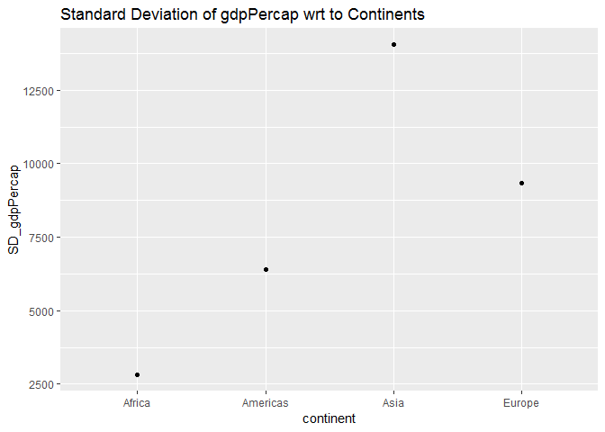
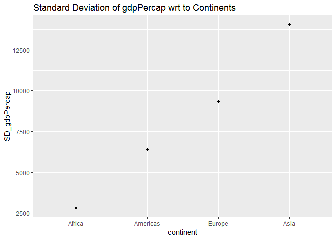
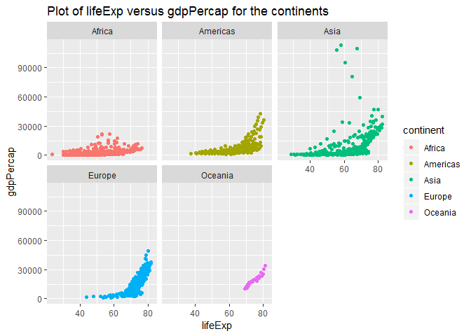
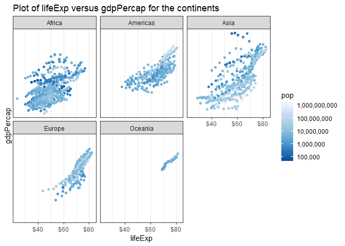

#### Load packages


The following packages were used for this assignment:


```r
suppressPackageStartupMessages(library(gapminder))
suppressPackageStartupMessages(library(ggplot2))
suppressPackageStartupMessages(library(tidyverse))
suppressPackageStartupMessages(library(knitr))
suppressPackageStartupMessages(library(kableExtra))
suppressPackageStartupMessages(library(plotly))
suppressPackageStartupMessages(library(reshape2))
suppressPackageStartupMessages(library(scales))
```


Goals:

- Reorder a factor in a principled way based on the data and demonstrate the effect in arranged data and in figures.
- Write some data to file and load it back into R.
- Improve a figure (or make one from scratch), using new knowledge, e.g., control the color scheme, use factor levels, smoother mechanics.
- Make a plotly visual.
- Implement visualization design principles.


### **Part1: Factor Management**

With the data set of your choice, after ensuring the variable(s) you’re exploring are indeed factors, you are expected to:

1. Drop factor / levels;
2. Reorder levels based on knowledge from data.

**1. Drop Levels**

Initially, the origial gapminder data was explored to extract some basic informations.


```r
# information of the data before removing factors
levels(gapminder$continent)
```

```
## [1] "Africa"   "Americas" "Asia"     "Europe"   "Oceania"
```

```r
nrow(gapminder)
```

```
## [1] 1704
```

```r
dim(gapminder)
```

```
## [1] 1704    6
```

```r
str(gapminder)
```

```
## Classes 'tbl_df', 'tbl' and 'data.frame':	1704 obs. of  6 variables:
##  $ country  : Factor w/ 142 levels "Afghanistan",..: 1 1 1 1 1 1 1 1 1 1 ...
##  $ continent: Factor w/ 5 levels "Africa","Americas",..: 3 3 3 3 3 3 3 3 3 3 ...
##  $ year     : int  1952 1957 1962 1967 1972 1977 1982 1987 1992 1997 ...
##  $ lifeExp  : num  28.8 30.3 32 34 36.1 ...
##  $ pop      : int  8425333 9240934 10267083 11537966 13079460 14880372 12881816 13867957 16317921 22227415 ...
##  $ gdpPercap: num  779 821 853 836 740 ...
```


It can be concluded that the gapminder data set has 5 levels of continents. It consists of 1704 rows and 6 columns. 


Now, lets drop on of the continent levels: Oceania


```r
# dropping levels

new_data <- gapminder %>% 
  filter(continent != "Oceania") %>% 
  droplevels()

# representing in the form if tables
knitr::kable(table(new_data$continent), col.names = c("Continent","Number of Countries")) %>% 
  kable_styling(bootstrap_options = "bordered", latex_options = "basic", full_width = F)
```

<table class="table table-bordered" style="width: auto !important; margin-left: auto; margin-right: auto;">
 <thead>
  <tr>
   <th style="text-align:left;"> Continent </th>
   <th style="text-align:right;"> Number of Countries </th>
  </tr>
 </thead>
<tbody>
  <tr>
   <td style="text-align:left;"> Africa </td>
   <td style="text-align:right;"> 624 </td>
  </tr>
  <tr>
   <td style="text-align:left;"> Americas </td>
   <td style="text-align:right;"> 300 </td>
  </tr>
  <tr>
   <td style="text-align:left;"> Asia </td>
   <td style="text-align:right;"> 396 </td>
  </tr>
  <tr>
   <td style="text-align:left;"> Europe </td>
   <td style="text-align:right;"> 360 </td>
  </tr>
</tbody>
</table>


```r
#information on the newdata formed after dropping levels

str(new_data)
```

```
## Classes 'tbl_df', 'tbl' and 'data.frame':	1680 obs. of  6 variables:
##  $ country  : Factor w/ 140 levels "Afghanistan",..: 1 1 1 1 1 1 1 1 1 1 ...
##  $ continent: Factor w/ 4 levels "Africa","Americas",..: 3 3 3 3 3 3 3 3 3 3 ...
##  $ year     : int  1952 1957 1962 1967 1972 1977 1982 1987 1992 1997 ...
##  $ lifeExp  : num  28.8 30.3 32 34 36.1 ...
##  $ pop      : int  8425333 9240934 10267083 11537966 13079460 14880372 12881816 13867957 16317921 22227415 ...
##  $ gdpPercap: num  779 821 853 836 740 ...
```

```r
nrow(new_data)
```

```
## [1] 1680
```

```r
levels(new_data$continent)
```

```
## [1] "Africa"   "Americas" "Asia"     "Europe"
```

```r
dim(new_data)
```

```
## [1] 1680    6
```


It can be seen that using `droplevels()` the number of levels changed to 4 whereas if we has used `filter()` function, the number of levels would still be 5. Thus, dropping factors helps in sorting the data and easier to analyse.


**2. Reordering the data**


For this exercise, we used the standard deviation of gdpPercap for each continents and tried to arrange and reorder the data.


```r
## standard deviation of a quantitative variable- gdpPercap

SD <- new_data %>% 
  group_by(continent) %>% 
  summarise(SD_gdpPercap = sd(gdpPercap))
knitr::kable(SD, col.names = c("Continent","SD of gdpPercap")) %>% 
  kable_styling(bootstrap_options = "bordered", latex_options = "basic", full_width = F)
```

<table class="table table-bordered" style="width: auto !important; margin-left: auto; margin-right: auto;">
 <thead>
  <tr>
   <th style="text-align:left;"> Continent </th>
   <th style="text-align:right;"> SD of gdpPercap </th>
  </tr>
 </thead>
<tbody>
  <tr>
   <td style="text-align:left;"> Africa </td>
   <td style="text-align:right;"> 2827.930 </td>
  </tr>
  <tr>
   <td style="text-align:left;"> Americas </td>
   <td style="text-align:right;"> 6396.764 </td>
  </tr>
  <tr>
   <td style="text-align:left;"> Asia </td>
   <td style="text-align:right;"> 14045.373 </td>
  </tr>
  <tr>
   <td style="text-align:left;"> Europe </td>
   <td style="text-align:right;"> 9355.213 </td>
  </tr>
</tbody>
</table>


```r
# visualising the change of SD within the continents

ggplot(SD, aes(continent, SD_gdpPercap)) +
  geom_point() +
  labs(title = "Standard Deviation of gdpPercap wrt to Continents")
```

<!-- -->


```r
#arranging the data

arrange_data <- new_data %>% 
  group_by(continent) %>% 
  summarise(SD_gdpPercap = sd(gdpPercap)) %>% 
  arrange(SD_gdpPercap)
knitr::kable(arrange_data, col.names = c("Continent","SD of gdpPercap")) %>% 
  kable_styling(bootstrap_options = "bordered", latex_options = "basic", full_width = F)
```

<table class="table table-bordered" style="width: auto !important; margin-left: auto; margin-right: auto;">
 <thead>
  <tr>
   <th style="text-align:left;"> Continent </th>
   <th style="text-align:right;"> SD of gdpPercap </th>
  </tr>
 </thead>
<tbody>
  <tr>
   <td style="text-align:left;"> Africa </td>
   <td style="text-align:right;"> 2827.930 </td>
  </tr>
  <tr>
   <td style="text-align:left;"> Americas </td>
   <td style="text-align:right;"> 6396.764 </td>
  </tr>
  <tr>
   <td style="text-align:left;"> Europe </td>
   <td style="text-align:right;"> 9355.213 </td>
  </tr>
  <tr>
   <td style="text-align:left;"> Asia </td>
   <td style="text-align:right;"> 14045.373 </td>
  </tr>
</tbody>
</table>


```r
ggplot(arrange_data, aes(continent, SD_gdpPercap )) +
  geom_point() +
  labs(title = "Standard Deviation of gdpPercap wrt to Continents")
```

<!-- -->


```r
#reordering the data

fctreorder_data <- new_data %>% 
  group_by(continent) %>% 
  summarise(SD_gdpPercap = sd(gdpPercap)) %>% 
  mutate(continent = fct_reorder(continent, SD_gdpPercap))
knitr::kable(fctreorder_data, col.names = c("Continent","SD of gdpPercap")) %>% 
  kable_styling(bootstrap_options = "bordered", latex_options = "basic", full_width = F)
```

<table class="table table-bordered" style="width: auto !important; margin-left: auto; margin-right: auto;">
 <thead>
  <tr>
   <th style="text-align:left;"> Continent </th>
   <th style="text-align:right;"> SD of gdpPercap </th>
  </tr>
 </thead>
<tbody>
  <tr>
   <td style="text-align:left;"> Africa </td>
   <td style="text-align:right;"> 2827.930 </td>
  </tr>
  <tr>
   <td style="text-align:left;"> Americas </td>
   <td style="text-align:right;"> 6396.764 </td>
  </tr>
  <tr>
   <td style="text-align:left;"> Asia </td>
   <td style="text-align:right;"> 14045.373 </td>
  </tr>
  <tr>
   <td style="text-align:left;"> Europe </td>
   <td style="text-align:right;"> 9355.213 </td>
  </tr>
</tbody>
</table>


```r
ggplot(fctreorder_data, aes(continent, SD_gdpPercap )) +
  geom_point() +
  labs(title = "Standard Deviation of gdpPercap wrt to Continents")
```

<!-- -->
 

```r
#reorder and arranging the data

arrange_reorder_data <- new_data %>% 
  group_by(continent) %>% 
  summarise(SD_gdpPercap = sd(gdpPercap)) %>% 
  mutate(continent = fct_reorder(continent, SD_gdpPercap)) %>% 
  arrange(SD_gdpPercap)
knitr::kable(arrange_reorder_data, col.names = c("Continent","SD of gdpPercap")) %>% 
  kable_styling(bootstrap_options = "bordered", latex_options = "basic", full_width = F)
```

<table class="table table-bordered" style="width: auto !important; margin-left: auto; margin-right: auto;">
 <thead>
  <tr>
   <th style="text-align:left;"> Continent </th>
   <th style="text-align:right;"> SD of gdpPercap </th>
  </tr>
 </thead>
<tbody>
  <tr>
   <td style="text-align:left;"> Africa </td>
   <td style="text-align:right;"> 2827.930 </td>
  </tr>
  <tr>
   <td style="text-align:left;"> Americas </td>
   <td style="text-align:right;"> 6396.764 </td>
  </tr>
  <tr>
   <td style="text-align:left;"> Europe </td>
   <td style="text-align:right;"> 9355.213 </td>
  </tr>
  <tr>
   <td style="text-align:left;"> Asia </td>
   <td style="text-align:right;"> 14045.373 </td>
  </tr>
</tbody>
</table>


```r
ggplot(arrange_reorder_data, aes(continent, SD_gdpPercap )) +
  geom_point() +
  labs(title = "Standard Deviation of gdpPercap wrt to Continents")
```

<!-- -->


**Observations:** It was observed that `arrange()` function arranges the data from the lowest to the highest value of `SD_gdppercap` that is in ascending order. The use of `fct_reorder()` did not affect the original order of the data while using `arrange()` and `fct_reorder()` together it was observed that the data was ordered in the same way as using `arrange()` alone. Therefore, `fct_reorder` didnot have much effect on the data.


#### **Part2: FileI/O**


Experiment with one or more of write_csv()/read_csv() (and/or TSV friends), saveRDS()/readRDS(), dput()/dget(). Create something new, probably by filtering or grouped-summarization of Gapminder.


For this exercise, lets output the maximum lifeExp of each continent and then read it back again.


```r
file<- gapminder %>% 
  group_by(continent) %>% 
  summarise(max_lifeExp = max(lifeExp))
knitr::kable(file, col.names = c("Continent","maximum lifeExp")) %>% 
  kable_styling(bootstrap_options = "bordered", latex_options = "basic", full_width = F)
```

<table class="table table-bordered" style="width: auto !important; margin-left: auto; margin-right: auto;">
 <thead>
  <tr>
   <th style="text-align:left;"> Continent </th>
   <th style="text-align:right;"> maximum lifeExp </th>
  </tr>
 </thead>
<tbody>
  <tr>
   <td style="text-align:left;"> Africa </td>
   <td style="text-align:right;"> 76.442 </td>
  </tr>
  <tr>
   <td style="text-align:left;"> Americas </td>
   <td style="text-align:right;"> 80.653 </td>
  </tr>
  <tr>
   <td style="text-align:left;"> Asia </td>
   <td style="text-align:right;"> 82.603 </td>
  </tr>
  <tr>
   <td style="text-align:left;"> Europe </td>
   <td style="text-align:right;"> 81.757 </td>
  </tr>
  <tr>
   <td style="text-align:left;"> Oceania </td>
   <td style="text-align:right;"> 81.235 </td>
  </tr>
</tbody>
</table>


```r
write_csv(file, "file_csv.csv")
file_csv <- read_csv("file_csv.csv")
```

```
## Parsed with column specification:
## cols(
##   continent = col_character(),
##   max_lifeExp = col_double()
## )
```

```r
file_csv
```

```
## # A tibble: 5 x 2
##   continent max_lifeExp
##   <chr>           <dbl>
## 1 Africa           76.4
## 2 Americas         80.7
## 3 Asia             82.6
## 4 Europe           81.8
## 5 Oceania          81.2
```


We observe that the output is same in both the cases.


Trying on `saveRDS`, `dput()/dget()` functions 


```r
saveRDS(file, "file_rds.rds")

file_rds <- readRDS("file_rds.rds")
file_rds
```

```
## # A tibble: 5 x 2
##   continent max_lifeExp
##   <fct>           <dbl>
## 1 Africa           76.4
## 2 Americas         80.7
## 3 Asia             82.6
## 4 Europe           81.8
## 5 Oceania          81.2
```


```r
dput(file, "file.txt")

file_get <- dget("file.txt")
file_get
```

```
## # A tibble: 5 x 2
##   continent max_lifeExp
##   <fct>           <dbl>
## 1 Africa           76.4
## 2 Americas         80.7
## 3 Asia             82.6
## 4 Europe           81.8
## 5 Oceania          81.2
```


We can see that all the above functions give the same output as the original output.


#### **Part3: Visualisation Design**


Creating a plot of lifeExp v/s gdpPercap and modifying the plot using visualistaion design recently learned in class.

The plot shows the relation between lifeExp and gdpPercap for each continent using facet_wrap.


```r
gapminder %>% 
  ggplot(aes(lifeExp, gdpPercap )) +
  facet_wrap(~continent) +
  geom_point(aes(color = continent)) +
  labs(title = "Plot of lifeExp versus gdpPercap for the continents")
```

<!-- -->


The use of visuale design on the above graph made the analyses easier. The graph below was extracted from the above but some extra features were added. The y_scale was changed to `logarithm_scale` which gave a clear and broader picture as compared to the above one. Also using palette color for `pop` helped us determine the number of people with a particular lifeExp range.


```r
figure <-gapminder %>% 
  ggplot(aes(lifeExp, gdpPercap )) +
  facet_wrap(~continent) +
  geom_point(aes(color = pop)) +
  scale_x_continuous(labels=dollar_format()) +
  scale_colour_distiller(
         trans   = "log10",
         breaks  = 10^(1:10),
         labels  = comma_format(),
         palette = "Blues"
     ) +
 scale_y_log10(breaks=10*(1:10)) +
     theme_bw() +
  labs(title = "Plot of lifeExp versus gdpPercap for the continents")
figure
```

<!-- -->


Next, we convert the above graph into a plotly plot.


```r
library(plotly)
#ggplotly(p)
```


#### **Part4: Writing figures to files**


Use ggsave() to explicitly save a plot to file. Then use embed it in your report.


Firstly, we use `ggsave()` to save the above figure as a `.png` file


```r
ggsave("my_plot.png", plot = figure, width = 10, height = 5, dpi = 100)
```


Next, we embed the plot in this report.


